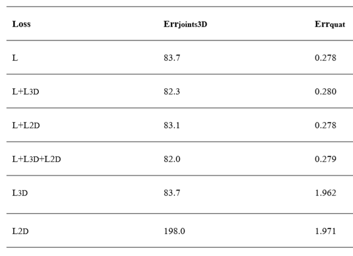
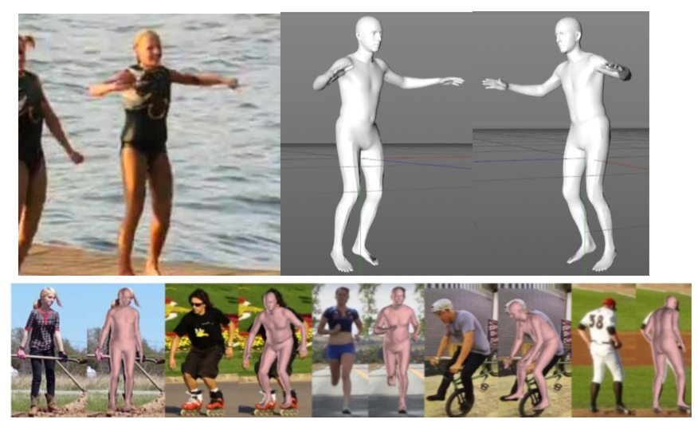

# Motion Capture CV
## 简述
捕捉人体动作是影视动画制作中的重要步骤，也是一种有效的人机交互媒介。但是一直以来，3D动作重建（动作捕捉）都需要比较昂贵的深度摄像头、定位传感器等专用设备。针对于这个问题，我们在阅读大量机器学习、计算机视觉领域前沿文献的基础上，实现了一种基于视觉图像的3D动作重建算法。可以基于图像和视频捕捉重建人体动作和体型。可以有效降低动作捕捉技术的应用成本。

## 研究背景及意义
动作捕捉技术涉及惯性导航、人体工程学、计算机图形学等多个交叉学科。近年来,随着传感器技术的发展,惯性导航技术的革新和计算硬件水平的不断提高,动作捕捉技术取得大量进展，在国内外均发展到一定水平。但依然受制于硬件成本的限制，很难实现大规模应用。近几年，在统计学习技术快速发展的背景下，基于神经网络手段解决姿态估计问题的方法不断涌现，凭借神经网络优秀的模式捕捉能力，在姿态估计问题上不仅减少了需要的信息，精度也得到了提高[1]。姿态估计与动作捕捉作为类似的任务，自然也可以尝试用这类算法解决。因此，在近些年计算机视觉与机器视觉领域前沿论文的基础上，我们实现了一种基于视觉图像的动作捕捉算法，可以大大降低动作捕捉技术的应用成本，促进它在物联网前端、人机交互、影视动画制作等领域的应用。

## 设计目标
算法接受RGB图像作为输入，使用up模型[2]标定画面中的人物位置，将人物置于中心裁剪为标准512*512输入，送入核心计算模型。我们选择SMPL模型[3]作为3D重建的目标，SMPL是一种基于顶点的蒙皮模型，能够准确地表现人体自然姿势中的各种体形，展现出精确地软组织动力学特征，而不像传统模型一样会在关节处产生不切实际的变形，并可以通过较少的参数定义精确地人体姿态和体型变化。因为这些特点，它成为了近两年来诸多人体3D重建相关研究的目标模型。

## 理论架构
### 简述
与近期的一些相关工作[4,5,6]相同，我们的模型使用了损失函数驱动的混合CNN架构。具体来说，从图像中，CNN预测SMPL 3D人体模型的参数——全局姿势由身体部位(body parts)`Theta`之间的相对角度控制、局部形状由网格表面参数`Beta`控制。给定姿势和表面参数可以生成密集网格，然后进行身体部分上的全局旋转来转换到所需位置。我们模型的任务即可是对渲染过程进行逆向工程并预测SMPL模型的参数（`Theta`和`Beta`）。这个“逆向”的过程即是通过损失函数进行优化上的约束：将得到的3D模型重新投影到图像上，以评估2D空间中的损失。
### 预测与监督的二段式架构
因此模型分为两部分，第一部分直接预测SMPL模型的参数，这些参数传递给SMPL库以产生3D网格。第二部分将3D网格的关节投影重投影到2D姿态估计算法[7]对原图进行标注的结果上（2D姿态估计结果在这里被视为可信的正确数据），衡量3D投影与2D姿态估计间的误差。因此，本模型包含全3D监督（通过少量的3D标注实现）和弱2D监督。它既不需要像以往的SMPL重建研究[8]一样进行仔细地初始化，也不需要大量的3D标注数据。
### 更利于优化的结构和中间表示
在能达到目的的基础上，我们还需要尽可能地减少优化计算量。参照Mohamed Omran等人的工作[9]，本模型将SMPL库的一些网格化计算直接集成到CNN中，形成了一个可微传递形式，这样就不需要多个网络头来反向传播2D和3D损失。这样，很多网络部件可以独立进行优化，这减少了超参数数量。同样根据Mohamed Omran等人[9]的架构，我们使用语义分割作为数据的中间表示，因为它可以提供比关键点或轮廓更丰富的信息。因为我们将前面说的第一部分再分为两个子阶段：第一阶段中，RGB图像产生语义分割。第二阶段采用此分割结果来预测身体网格的低维参数（即SMPL参数）。

## 性能分析
### 定量分析
#### 语义中间表示的作用分析
在我们的模型中引入了语义图作为中间表示，那么这种表示的引入是否对模型精度有所帮助？针对这个问题进行定量分析：

根据Mohamed Omran等人[9]的工作，我们使用预训练模型配置三个不同的语义分割模型：RefineNet[10]以及两种DeepLab变种[11]（基于VGG-16[12]和ResNet-101[13]）。

这些网络在UP验证集上的IoU分数分别为67.1,57.0和53.2。这可以说明它们的质量。然后我们分别使用这三个不同的语义分割模型训练三个3D预测网络，然后回测这些网络的精度。结果如表：

与预料的相同，分割模型越好，3D预测精度越高。

#### 不同监督损失的组合对比研究
我们的模型中既使用了公开训练集上的3D监督，也使用了2D重投影来进行误差计算，那么这两个损失之间存在什么样的关系？2D重投影误差的引入是否达到了我们减少标注数据的目的？针对这个问题进行定量分析：

对基准监督、3D监督、2D监督三个损失函数进行组合，分别使用这些组合训练模型，然后测试它们的3D关节位置误差(`Err_joints3D`)和身体部分旋转误差（`Err_quat`），结果如下表：

可以看出，混合损失对于提高精度有着一定帮助。只有2D重投影损失的训练结果误差很大，表明需要一定量的3D标注来克服2D关键点固有的模糊性。

### 定性分析
我们在公开动作图像数据集的验证集上使用本模型进行了推断，一些结果如下：

## 创新点及应用
创新上，本模型使用2D姿态估计结果作为预测RGB图像到人体模型（SMPL参数）神经网络的约束，将3D人体模型重投影到2D关键点来计算误差，以此达成自监督学习。全3D和弱2D双重监督省去了大量训练数据。使用语义图作为中间表示有效提高了模型精度。优化友好的网络架构也使得模型具有更好的收敛性和泛化性能。

应用上，基于现实世界视觉数据（而非绿幕影像）的动作捕捉模型具有广阔的应用前景——不仅可以加载于监控设备上，用于安防、患者监控等领域，也会为更人性化和低成本的的人机交互开辟道路。它还将影响CG和游戏行业的发展方向。角色动作捕捉目前仍然需要动画师的繁琐劳动、或使用昂贵的专业设备来达到所需的准确度，本模型之后对于精度的持续改进将会有效降低该领域的工作成本、解放美术劳动力。

## 参考文献
* [1] Chu X , Ouyang W , Li H , et al. Structured Feature Learning for Pose Estimation[J]. 2016.
* [2] Lassner C , Romero J , Kiefel M , et al. Unite the People: Closing the Loop Between 3D and 2D Human Representations[J]. 2017.
* [3] Loper M , Mahmood N , Romero J , et al. SMPL: a skinned multi-person linear model[J]. ACM Transactions on Graphics (TOG), 2015, 34.
* [4] J.K.V.Tan,I.Budvytis,andR.Cipolla. Indirectdeep structured learning for 3d human body shape and pose prediction. In BMVC, volume 3, page 6, 2017.
* [5] A.Kanazawa,M.J.Black,D.W.Jacobs,andJ.Malik. End-to-end recovery of human shape and pose. In Proceedings of the IEEE Conference on Computer Vision and Pattern Recognition, 2018.
* [6] G. Pavlakos, L. Zhu, X. Zhou, and K. Daniilidis. Learning to estimate 3D human pose and shape from a single color image. In Proceedings of the IEEE Conference on Computer Vision and Pattern Recognition, 2018.
* [7] Ranjan R , Patel V M , Chellappa R . HyperFace: A Deep Multi-task Learning Framework for Face Detection, Landmark Localization, Pose Estimation, and Gender Recognition[J]. IEEE Transactions on Pattern Analysis and Machine Intelligence, 2017:1-1.
* [8] Bogo F , Kanazawa A , Lassner C , et al. Keep it SMPL: Automatic Estimation of 3D Human Pose and Shape from a Single Image[J]. 2016.
* [9] Omran M , Lassner C , Pons-Moll G , et al. [IEEE 2018 International Conference on 3D Vision (3DV) - Verona, Italy (2018.9.5-2018.9.8)] 2018 International Conference on 3D Vision (3DV) - Neural Body Fitting: Unifying Deep Learning and Model Based Human Pose and Shape Estimation[J]. 2018:484-494.
* [10] Lin G , Milan A , Shen C , et al. RefineNet: Multi-Path Refinement Networks for High-Resolution Semantic Segmentation[J]. 2016.
* [11] L.-C. Chen, G. Papandreou, I. Kokkinos, K. Murphy, and A. L. Yuille. Deeplab: Semantic image segmentation with deep convolutional nets, atrous convolution, and fully connected crfs. arXiv preprint arXiv:1606.00915, 2016.
* [12] K. Simonyan and A. Zisserman. Very deep convolutional networks for large-scale image recognition. arXiv preprint arXiv:1409.1556, 2014
* [13] K. He, X. Zhang, S. Ren, and J. Sun. Deep residual learning for image recognition. In IEEE Conference on Computer Vision and Pattern Recognition (CVPR), 2016.
* [14] M. Jaderberg, K. Simonyan, A. Zisserman, and K. Kavukcuoglu. Spatial transformer networks. In NIPS, 2015.
